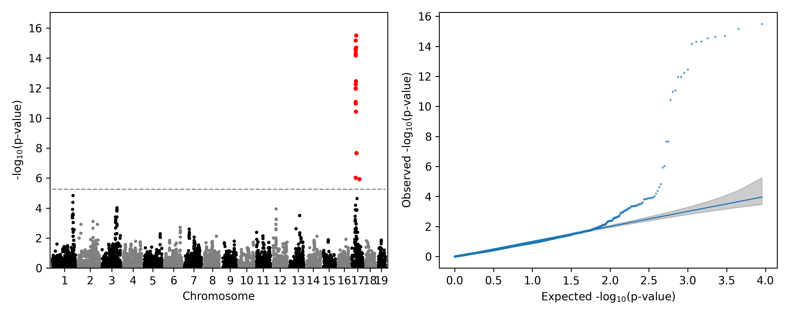

# pyBLUP

[English](./README.md) | [简体中文(推荐)](./doc/README_zh.md)

## Usage

### CLI usage of GWAS

```shell
git clone https://github.com/MaizeMan-JxFU/gtools.git
cd gtools
# .\install.bat # windows
# .\gtools gwas --vcf example/mouse_hs1940.vcf.gz --pheno example/mouse_hs1940.pheno --out test
chmod +x ./install.sh; ./install.sh # unix
./gtools gwas --vcf example/mouse_hs1940.vcf.gz --pheno example/mouse_hs1940.pheno --out test

```



Test data in example is from [genetics-statistics/GEMMA](https://github.com/genetics-statistics/GEMMA), published in [Parker et al, Nature Genetics, 2016](https://doi.org/10.1038/ng.3609)

## Update

```shell
git pull; ./install.sh
```
